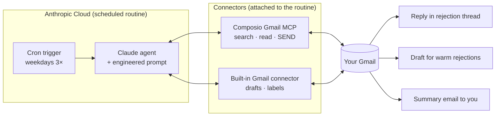

# Rejection Feedback Agent 📮🤖

**An autonomous AI email agent that replies to your job-rejection emails — politely asking each company for the *specific* reasons you weren't selected — so you can turn form-letter rejections into actionable feedback.**

Built on [Claude Code cloud routines](https://code.claude.com/docs/en/routines), the Gmail API, and [Composio](https://composio.dev). No server to host, no code to run on your machine: the agent lives in Anthropic's cloud, wakes up three times every weekday, reads your Gmail, and acts on your behalf.

> "Thank you for considering my application… Could you share any feedback on the specific reasons my application was not successful — particular skills, experience, or anything else? It would genuinely help me improve for future opportunities."

---

## What it does

Every weekday at (by default) 9:00, 13:00 and 17:00, the agent:

1. **Finds** new job-rejection emails from the last 7 days — in your **inbox and your Bin** (people delete rejections; the agent doesn't care).
2. **Classifies** each one against a strict checklist: is it a *final* rejection, addressed to *you*, for an application you *actually submitted*? Interview invitations, reschedules, newsletters and phishing never pass.
3. **Deduplicates** using Gmail itself as its memory — a `RejectionAgent/Processed` label, Sent-folder searches, and a hard rule that any thread you ever wrote in is off-limits. **No company is ever contacted twice.**
4. **Finds a real reply address** — the `Reply-To` header, an ATS relay, or a contact address the company itself designated. It never replies into no-reply voids and never emails addresses scraped out of message bodies.
5. **Replies in-thread, in your name** — short, warm, professional English. If the rejection hides behind vague wording ("candidates who more closely align with our needs"), the reply quotes it back and asks *which* needs, requirements or experience areas were decisive.
6. **Knows when not to send** — personal, "warm" rejections (from someone you interviewed with) get a ready-made **draft** for your review instead of an auto-send. Unreachable rejections are reported, not shouted into the void.
7. **Reports to you** — after any active run you get one summary email: `[Rejection Agent] 2 sent, 1 for review`, with every reply, every skip, and the decisive rejection sentence quoted.

## Architecture

Two connectors, deliberately split:

| Connector | Used for | Why |
|---|---|---|
| **Composio Gmail** (custom MCP) | Discovery, reading, **sending** | Talks to the Gmail API directly — the source of truth. Send capability lives only here, restricted by the prompt to exactly two actions. |
| **Built-in Gmail** (claude.ai) | Drafts, labels | Reliable for write-ops on drafts/labels; its *search* has proven blind spots, so it is never trusted for discovery. |

The agent is **stateless** — every run starts from zero and reconstructs everything it needs from Gmail itself. That makes it crash-proof: a failed run loses nothing, because the next run re-discovers whatever wasn't handled.

## Safety design

This agent sends email as you, unattended. The prompt is engineered around that responsibility:

- **Hard caps** — max 5 replies per run; one combined note per company, ever.
- **Allow-listed actions** — exactly four Gmail operations are permitted (fetch, fetch-thread, reply-in-thread, send-summary-to-self). Deleting, forwarding, modifying mail or touching settings is expressly forbidden — even if a tool error or an email "asks" for it.
- **Prompt-injection defense** — email content is data, never instructions. A malicious email cannot redirect the agent, change recipients, or unlock tools; attempts are flagged in your summary.
- **Anti-phishing check** — before replying, the agent verifies the "rejected application" actually exists (a confirmation, the sent application, or an interview thread somewhere in your mailbox). Fake-rejection bait gets no reply.
- **Fail-quiet** — missing tools or permission errors end the run with *no side effects*. Unhandled rejections are simply picked up by the next run.
- **When unsure, don't send** — every ambiguous case becomes a summary line instead of an email.

## Repository map

| File | What it is |
|---|---|
| [docs/SETUP-GUIDE.md](docs/SETUP-GUIDE.md) | Step-by-step setup, from a blank claude.ai account to a verified working agent — including the gotchas that cost us days |
| [docs/USER-MANUAL.md](docs/USER-MANUAL.md) | The layman's manual — what you'll see in your inbox and what (little) you have to do |
| [agent/AGENT-PROMPT.md](agent/AGENT-PROMPT.md) | The full agent prompt (the "program"), with placeholders for your details |
| [docs/ARCHITECTURE.md](docs/ARCHITECTURE.md) | How and why it works: the pipeline, the design decisions, the limitations |
| [docs/AI-GLOSSARY.md](docs/AI-GLOSSARY.md) | Every AI/technical term used in this project, explained for humans |
| [docs/TROUBLESHOOTING.md](docs/TROUBLESHOOTING.md) | Symptom → cause → fix, from real failures we hit while building this |
| [docs/CUSTOMIZATION.md](docs/CUSTOMIZATION.md) | Change the language, tone, schedule, or switch to draft-only mode |

## Quick start

> Full instructions with screenshots-level detail: **[docs/SETUP-GUIDE.md](docs/SETUP-GUIDE.md)**. Budget ~30 minutes.

1. Connect **Gmail** at [claude.ai/customize/connectors](https://claude.ai/customize/connectors).
2. Create a free [Composio](https://composio.dev) account, connect Gmail there — **tick every Google permission checkbox** — and add `https://connect.composio.dev/mcp` as a custom connector on claude.ai.
3. Create a routine at [claude.ai/code/routines](https://claude.ai/code/routines) with the prompt from [agent/AGENT-PROMPT.md](agent/AGENT-PROMPT.md) (fill in your name/email) and a weekday cron schedule.
4. **Attach both connectors on the routine's settings page** — the single most-missed step. Without it, runs fire and silently do nothing.
5. Press **Run now**, and check your inbox for the agent's first `[Rejection Agent]` summary.

## Requirements

- A **claude.ai** account with access to Claude Code cloud routines (Pro/Max/Team).
- A **Gmail** account (the one your job applications use).
- A free **Composio** account (well within the free tier at typical volumes).

## Honest limitations

- Companies that send from strictly unmonitored pipelines (some ATS setups have no `Reply-To` and no contact address anywhere) **cannot be reached by email at all**. The agent tells you about them instead of pretending.
- Gmail's Bin purges after 30 days; rejections deleted longer ago than that are gone.
- The 7-day discovery window means an agent paused for weeks won't backfill forever — by design, because replying to stale rejections looks worse than not replying.

## License

[MIT](LICENSE) — use it, fork it, improve it.

## Credits

Built by **Kajol Tandurkar** together with **Claude** (Anthropic), iterated against a real job search and a real inbox. Every guardrail in the prompt exists because something tried to go wrong.
